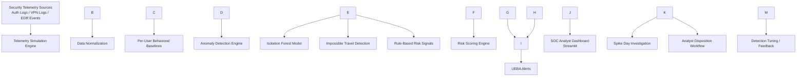

# Zero Trust AI Behavioral Analytics

An end-to-end **Zero Trust behavioral analytics pipeline** that models user activity, establishes UEBA baselines, and detects high-risk anomalies using machine learning.

The system applies **Isolation Forest anomaly detection** to identify suspicious behavioral deviations and supports **SOC investigation workflows and case management**.

This project demonstrates practical implementation of **Zero Trust architecture, UEBA analytics, and AI-assisted cyber threat detection** within a simulated enterprise security environment.

\## Architecture

This architecture simulates a behavioral security analytics pipeline used in modern Zero Trust environments. Security telemetry from multiple sources is normalized and used to build per-user behavioral baselines. Machine learning and rule-based analytics identify anomalies, assign risk scores, and generate alerts that analysts can investigate through an interactive SOC dashboard.

🚀 Project Highlights

✅ Multi-source security telemetry simulation (Auth, VPN, EDR)

✅ Per-user behavioral baselining (z-score deviations)

✅ Impossible travel detection

✅ Isolation Forest anomaly detection

✅ Rule-based risk signals

✅ Interactive SOC dashboard (Streamlit)

✅ Spike day drill-down investigation view

✅ Recommended analyst actions

✅ Analyst disposition workflow

✅ Persistent case logging

✅ Case review dashboard

🧭 Architecture

See full architecture:

➡️ ARCHITECTURE.md

Pipeline layers:

Telemetry generation

Feature engineering \& behavioral baselines

Anomaly detection

Analyst investigation experience

🧠 Why This Matters

Traditional threshold alerts generate high false positives.

This system instead:

models normal behavior per user

detects statistical deviations

provides analyst context and workflow support

This aligns with modern:

Zero Trust principles

UEBA platforms

SOC automation trends

📊 Detection Approach

Behavioral Baselines

For each user, the pipeline computes:

mean

standard deviation

z-score deviations

Example features:

z\_failures

z\_mfa\_denied

z\_noncompliant

z\_high\_sev

z\_max\_speed\_kmh

This reduces false positives versus static thresholds.

Machine Learning Model

Model: Isolation Forest

Used for:

unsupervised anomaly detection

multi-feature behavioral analysis

risk scoring

Output fields:

anomaly\_score

anomaly\_flag

rule\_suspicious

Security Analytics Implemented

Impossible travel detection

MFA fatigue indicators

Endpoint posture risk

VPN anomaly signals

EDR severity spikes

Unsigned binary execution

🖥 SOC Analyst Experience

The Streamlit dashboard provides:

🔎 Detection Views

Top Risk Days

Per-user trend sparklines

Z-score deviation drivers

🧪 Investigation Tools

Spike day drill-down

±7 day user context

Key signal inspection

Recommended analyst actions

🧾 Case Management

Analyst disposition workflow

Investigation notes

Persistent case logging

Case review dashboard

Case filtering \& search

⚙️ How to Run Locally

1️⃣ Create virtual environment

python -m venv .venv

.\\.venv\\Scripts\\Activate.ps1

2️⃣ Install dependencies

pip install -r requirements.txt

3️⃣ Generate synthetic telemetry

.\\run.ps1 -Mode gen -Rows 20000

4️⃣ Build feature dataset

.\\run.ps1 -Mode build

5️⃣ Train anomaly model

.\\run.ps1 -Mode train

6️⃣ Score events

.\\run.ps1 -Mode score

7️⃣ Launch SOC dashboard

.\\run.ps1 -Mode dashboard

📁 Repository Structure

zero-trust-ai/

├── data/

│   ├── raw/

│   └── processed/

├── models/

├── src/

│   ├── sim/

│   └── pipeline/

├── dashboard/

├── run.ps1

└── requirements.txt

🎯 Skills Demonstrated

Zero Trust analytics

UEBA behavioral modeling

Security feature engineering

Anomaly detection (unsupervised ML)

Python data pipelines

SOC workflow design

Streamlit dashboard development

Investigation lifecycle tracking

🔮 Potential Enhancements

Azure deployment

real log ingestion

MITRE ATT\&CK mapping

feedback loop into model

risk scoring bands

alert routing automation

👤 Author

Ryan Holmes

Security \& AI practitioner transitioning from U.S. Navy service into defense-adjacent cyber/AI roles.

Azure AI-900 certified

Security+ (in progress)

Active clearance

📌 License

For educational and portfolio demonstration purposes.

